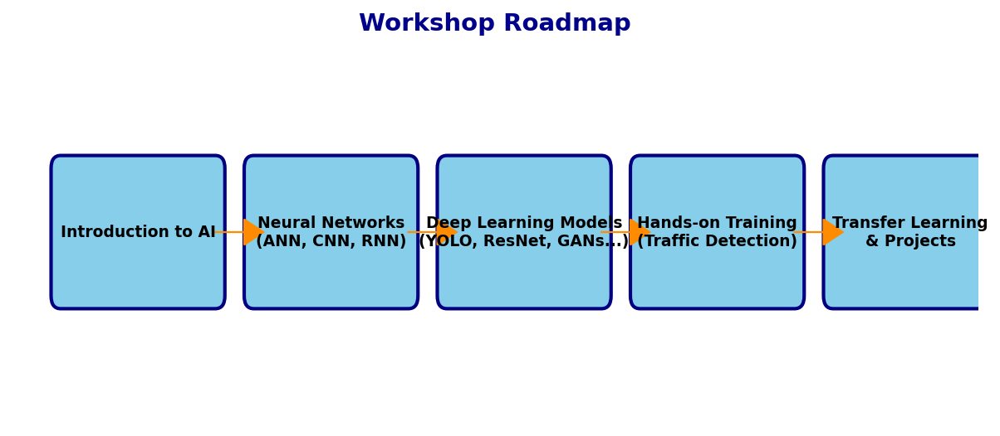
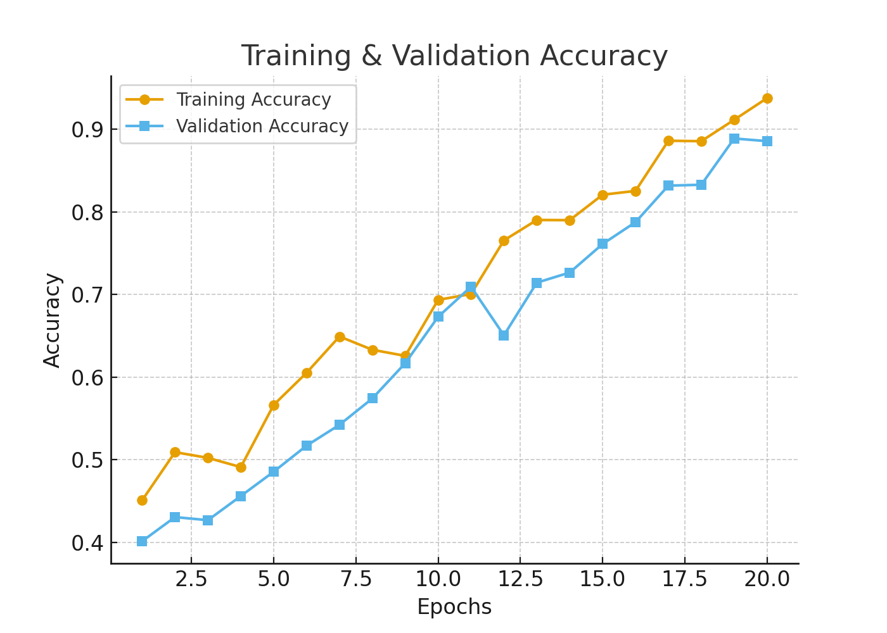
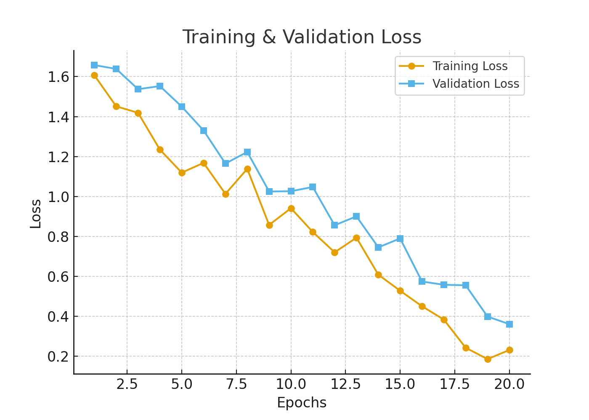
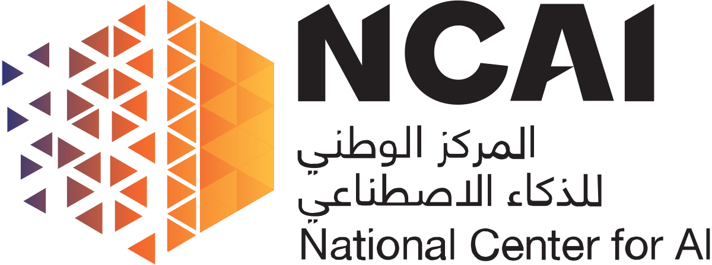

# 🎓 **Workshop on AI and Hands-on Training**

Welcome to the **AI & Deep Learning Workshop**!  
This workshop is designed to provide both **conceptual understanding** and **practical experience** in Artificial Intelligence and Deep Learning.  

---

## 📌 **What You’ll Learn**

✅ **Introduction to AI & Deep Learning**  
- Core concepts and building blocks  

✅ **Famous Neural Network Architectures**  
- Artificial Neural Network (ANN)  
- Convolutional Neural Network (CNN)  
- Recurrent Neural Network (RNN)  

✅ **Deep Learning Models**  
- YOLO  
- GoogleNet  
- MobileNet  
- ResNet  
- GANs (Generative Adversarial Networks)  

✅ **Hands-on Training**  
- Train a deep learning model from scratch  
- Example use case: *Traffic detection and recognition on highways*  

✅ **Transfer Learning**  
- Reuse pre-trained models to achieve better results with less data and computation  

✅ **Project Confidence**  
- Gain the skills to start your own AI/Deep Learning projects  

---

## 📊 **Workshop Roadmap**

  

---

## 📉 **Sample Graphs & Visuals**

### 🔹 Neural Network Training Accuracy

  

### 🔹 Loss Curve

  

### 🔹 Example Output (Traffic Detection)

  

---

## 👨‍🏫 **Instructor**
**Dr. Kamran Javed**  

---

## 🏷️ **Affiliations**

   &nbsp;&nbsp;&nbsp;&nbsp;
  

