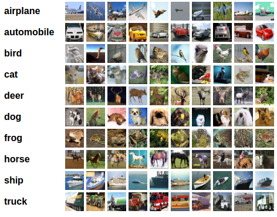

# 🤖 **Hands-on AI Fundamentals Training @ SDAIA (NCAI)**  
### 📌 *CIFAR-10 Image Classification using kNN*

---

## 🔍 **Overview**
This project applies the **k-Nearest Neighbors (kNN)** algorithm on the **CIFAR-10 dataset** to classify test images.  
We also performed **k-fold cross-validation** to determine the optimal value of the hyperparameter **k** and to evaluate the overall accuracy.

---

## ⚙️ **Requirements**
- 🐍 Python **3.5+**  
- 📦 `numpy`  
- 📊 `matplotlib`

---

## 📈 **Results**
The dataset was **subsampled** (10,000 training samples + 1,000 testing samples) to reduce memory usage.  
The **best performance** from k-NN classification was:  

- ✅ Best **k** = `10`  
- 🎯 Accuracy = **57%**

---

## 👨‍🏫 **Presented By**
**Dr. Kamran Javed**

---

## 🏷️ **Affiliations**

   &nbsp;&nbsp;&nbsp;&nbsp;
  

---

## 📷 **Sample CIFAR-10 Images**
*(Optional: Add this if you want to showcase the dataset visually)*  

  

